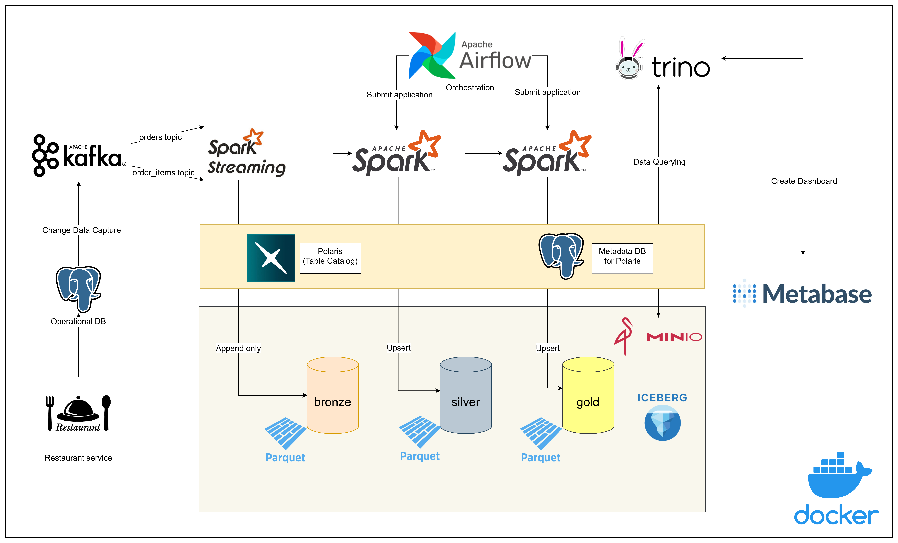
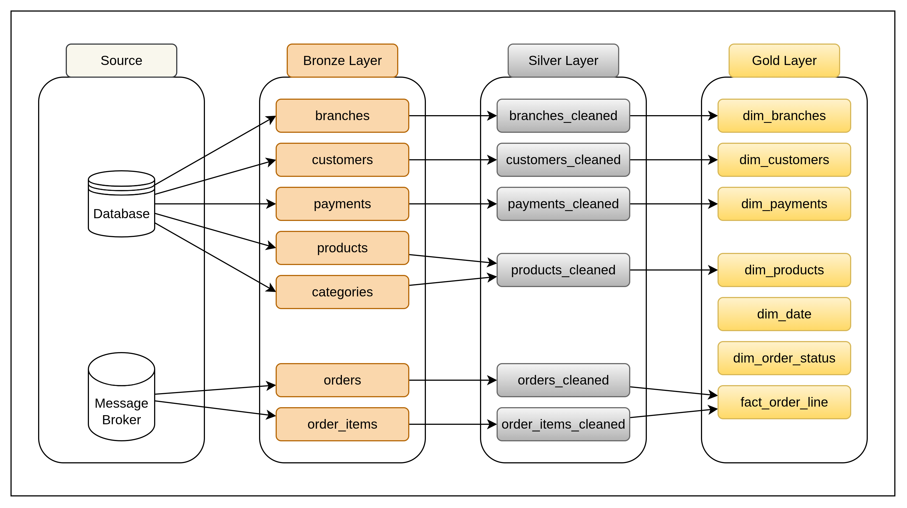
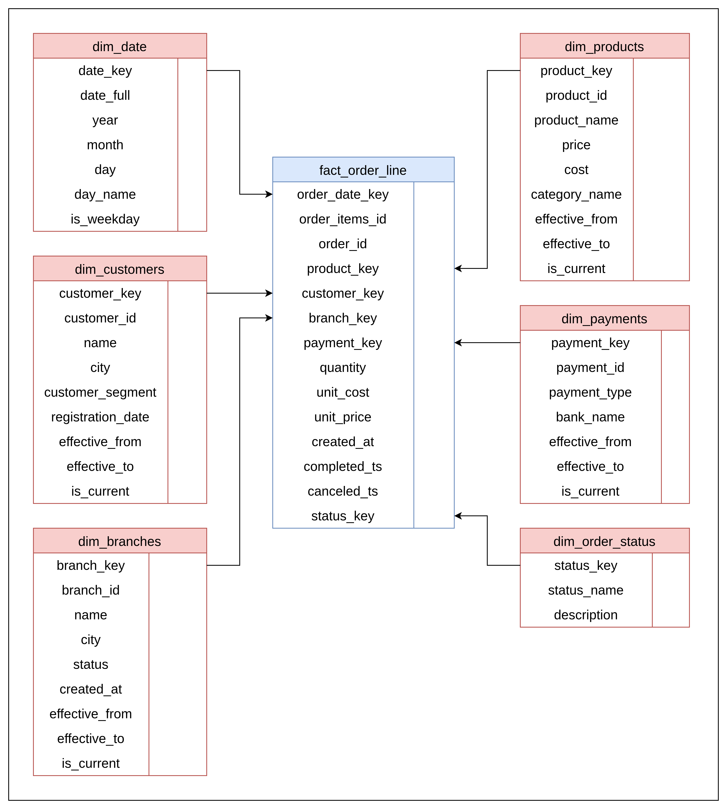
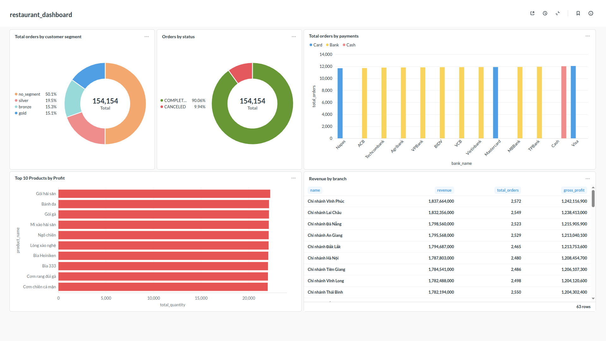

# Restaurant Data Pipeline

## Overview

This project implements an end-to-end real-time data pipeline for a simulated restaurant system.

Transactional events such as orders and order items are generated by a Kafka producer and streamed into a lakehouse architecture. The pipeline processes data using Apache Spark and organizes it into Bronze, Silver, and Gold layers using Apache Iceberg.

The final datasets are modeled using a star schema and queried with Trino for analytics and dashboarding in Metabase.


## Key Features

* Real-time event ingestion using Apache Kafka
* Change Data Capture (CDC) pipeline by Debezium
* Streaming and batch processing with Apache Spark
* Lakehouse architecture built on Apache Iceberg tables + Polaris catalog
* Medallion architecture (Bronze, Silver, Gold layers)
* Dimensional modeling with star schema for analytics
* Distributed SQL queries via Trino
* Business intelligence dashboards built with Metabase
* Workflow orchestration using Apache Airflow
* Fully containerized data platform using Docker Compose

## Project Goal
The goal of this project is to build an end-to-end real-time data pipeline for a simulated restaurant system. The pipeline captures transactional events, processes them using a medallion architecture, and produces analytical datasets for business intelligence and data science workloads.

## Data Source
A Python-based Kafka producer simulates restaurant transactions, including orders and order items. Static reference data such as products, categories, and payment methods are loaded from CSV files.

The producer continuously generates realistic transactional events to mimic a production restaurant system.
## Architecture

This platform simulates a modern data platform with streaming ingestion, lakehouse storage, and analytical serving layers.

Main components:

- CDC ingestion using Debezium
- Streaming transport using Kafka
- Stream & batch processing with Spark
- Iceberg tables stored in MinIO
- Metadata catalog managed by Polaris
- Interactive SQL queries via Trino
- BI dashboards built with Metabase


#  Data Flow
The data pipeline follows a Medallion Architecture pattern, organizing data into three layers: Bronze, Silver, and Gold. Each layer progressively improves data quality and structure to support analytics workloads.

## Bronze Layer
The Bronze layer stores raw data ingested from streaming events with minimal transformation. It preserves the original schema and serves as the source of truth for replay and debugging.

## Silver Layer
Contains cleaned and standardized datasets derived from the Bronze tables. Transformations applied in this stage include: 
- Data cleaning
- Schema normalization
- Deduplication
- Type casting
- Basic joins 

The goal is to produce reliable datasets suitable for analytics and downstream transformations. Data in this layer provides a consistent and validated representation of operational data.

## Gold Layer
Contains business-ready analytical datasets designed for reporting and dashboarding. This layer follows a star schema model, consisting of:
- Dimensional Tables: Dimensions store descriptive attributes used for slicing and filtering analytical queries. Dimension tables implement Slowly Changing Dimension Type 2 (SCD2) to track historical changes in dimension attributes.
- Fact Table: The fact table records transactional metrics such as: quantity, unit_price, unit_cost. Each row represents a single order item transaction, enabling analysis across products, customers, branches, and time.


# Data Modeling
The analytical layer of this project follows dimensional modeling, a design approach widely used in data warehouses to support efficient analytical queries.

The model is implemented as a star schema, where a central fact table stores transactional metrics and is connected to multiple dimension tables providing descriptive attributes.

## Technologies
- Data Ingestion
    - Debezium (CDC)
    - Apache Kafka (event streaming)
- Data Processing
    - Apache Spark (Structured Streaming + Batch ETL)
- Lakehouse
    - Apache Iceberg
    - MinIO (S3 storage)
    - Apache Polaris (Iceberg catalog)
- Analytics
    - Trino
    - Metabase
- Orchestration
    - Apache Airflow
- Infrastructure
    - Docker Compose
- Database
    - PostgreSQL
# Project Structure
```
.
├── airflow
│   ├── config
│   │   └── airflow.cfg
│   ├── dags
│   │   └── restaurant_pipeline.py
│   ├── Dockerfile
│   └── requirements.txt
├── connectors
│   ├── connector.json
├── init_db
│   ├── 00_config.sql
│   └── 01_schema.sql
├── minio
│   └── init-bucket.sh
├── polaris
│   ├── create-catalog.sh
│   └── obtain-token.sh
├── restaurant_producer
│   ├── data
│   │   ├── categories.csv
│   │   ├── payments.csv
│   │   └── products.csv
│   ├── Dockerfile
│   ├── load_static_data.py
│   ├── producer.py
│   └── requirements.txt
├── spark
│   └── Dockerfile
├── src
│   └── spark-job
│       ├── bronze
│       │   ├── bronze_dimension.py
│       │   └── bronze_order_tables.py
│       ├── gold
│       │   ├── dim_branches.py
│       │   ├── dim_customers.py
│       │   ├── dim_payments.py
│       │   ├── dim_products.py
│       │   └── fact_order_line.py
│       ├── lib
│       │   ├── ddl.py
│       │   ├── schema.py
│       │   ├── spark_loader.py
│       │   ├── spark_transform.py
│       │   └── utils.py
│       ├── silver
│       │   ├── branches_cleaned.py
│       │   ├── customers_cleaned.py
│       │   ├── order_items_cleaned.py
│       │   ├── orders_cleaned.py
│       │   ├── payments_cleaned.py
│       │   └── products_cleaned.py
│       ├── init_lakehouse.py
│       └── lib.zip
├── trino
│   └── config
│       ├── catalog
│       │   └── iceberg.properties
│       ├── coordinator
│       │   └── config.properties
│       └── worker
│           └── config.properties
├── docker-compose.yaml
└── README.md
```
## How to Run
### Prerequisites
- Docker and Docker Compose
### Steps
1. Clone this repository:
```
git clone https://github.com/truongvude/restaurant_data_pipeline
cd restaurant_data_pipeline
```
2. Rename .env_example to .env
```
mv .env_example .env
```
3. Run compose
```
docker compose up
```
4. Wait for a few minutes for all services to be fully healthy.
### Access services
1. Airflow UI: http://localhost:8088
2. Minio UI: http://localhost:9001
3. Kafka UI: http://localhost:8080
4. Spark UI: http://localhost:8081
5. Trino UI: http://localhost:8082
6. Metabase UI: http://localhost:3000

## Dashboard


## Future Improvements
- Add data quality validation using Great Expectations
- Implement monitoring with Prometheus and Grafana
- Add schema registry for Kafka
- Implement incremental processing optimizations
- Support real-time analytics dashboards